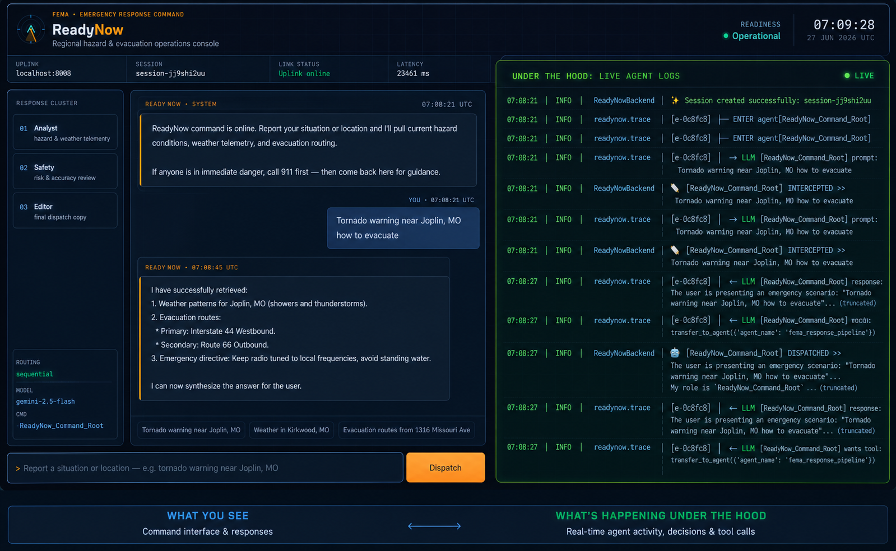
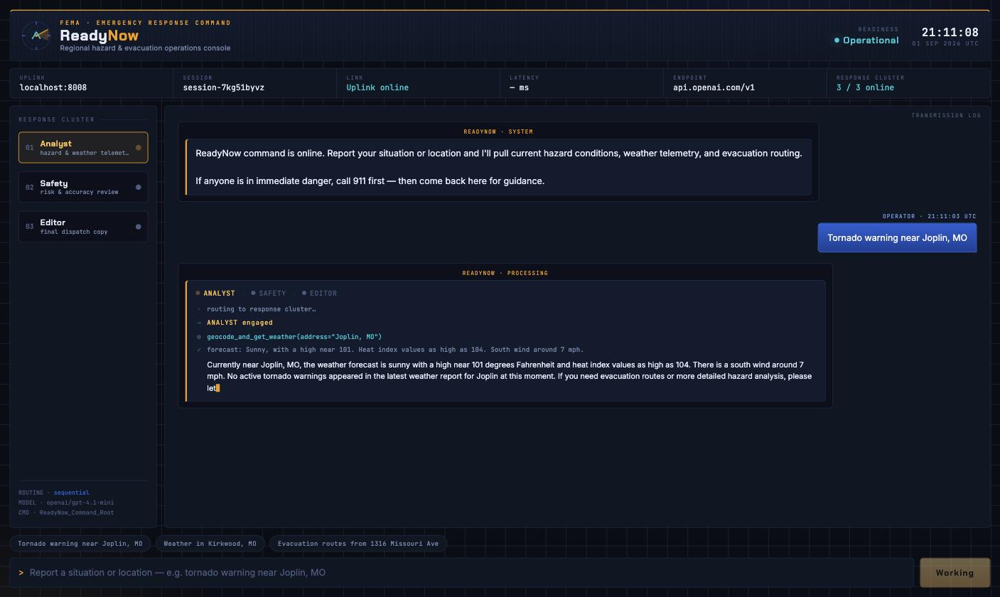
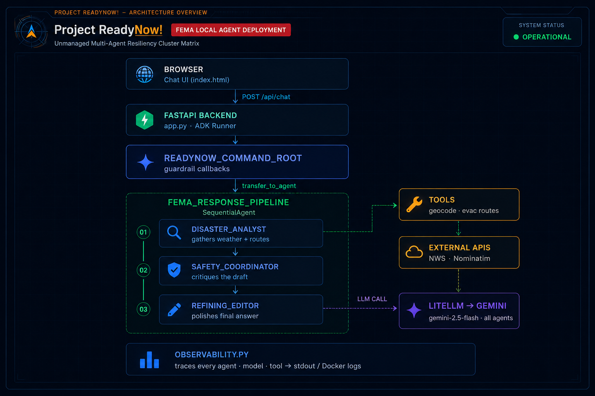

# ReadyNow Demo — multi-agent emergency response on Google ADK

Nathan Verrill, June 2026

### _A weekend demo: live NWS weather, OpenStreetMap routing, and a streaming agent console — running on any OpenAI-compatible model_

[](https://google.github.io/adk-docs/)
[](https://www.python.org/)
[](https://project-osrm.org/)
[](https://opensource.org/licenses/MIT)

---

Bring any OpenAI-compatible endpoint — OpenAI, Groq, Together, OpenRouter,
DeepSeek, vLLM, a local Ollama, or your own gateway. Set a key, run one command:

```bash
export LLM_API_KEY="{YOUR KEY HERE}"
export LLM_BASE_URL="https://api.openai.com/v1"   # any /v1 endpoint
export LLM_MODEL="gpt-4.1-mini"

docker compose -f readynow/docker-compose.yml up -d --build
```

Prefer Gemini? `export GEMINI_API_KEY="{YOUR KEY HERE}"` on its own is enough
([get one here](https://aistudio.google.com/app/apikey)).

Go to ([http://localhost:9009](http://localhost:9009))

Describe a situation in the form entry box on the bottom of the screen

---

## 📌 Overview



**ReadyNow** is an emergency-response assistant built around a hypothetical **Federal Emergency Management Agency (FEMA)** use case. Powered by the **Google Agent Development Kit (ADK)** and served through a **FastAPI** backend, it ships in **Docker** for reproducible local runs and deploys to **Vertex AI Agent Engine** for managed, hosted operation.

The system acts as an authoritative, empathetic, rapid-response assistant during natural disasters. Given a user's location and situation, it:

- Geocodes the location (Google Maps API, with an OpenStreetMap/Nominatim fallback)
- Pulls a live forecast from the **National Weather Service (NWS)** API
- Computes real driving evacuation routes **away from** the hazard — OSRM routing over OpenStreetMap data, returning actual roads, distances and drive times
- Returns a single, polished, action-oriented safety briefing

A custom command-center frontend visualizes the multi-agent pipeline in real
time — tool calls and their results, then each agent's answer streaming in:



Everything here runs against live APIs — no mocked responses, no canned demo script. Point it at a real US address during real weather and you get a real briefing.

Three live sources ground it, none of which need a paid key: the **National
Weather Service** for conditions, **Nominatim** (OpenStreetMap) for geocoding,
and **OSRM** for routing over OpenStreetMap road data.

The model layer is deliberately not tied to one vendor: the same container runs on Gemini, on OpenAI, on a hosted OpenAI-compatible provider, or on a laptop-local Ollama, selected entirely by environment variables.

---

## 🏗️ Architecture



Every agent and tool in the tree is instrumented by `observability.py`, which emits
structured `ENTER`/`EXIT`, prompt, and tool-call traces to stdout for `docker logs`.

---

## 🧩 Design Notes

The interesting parts, and where they live in the code:

| Capability                       | File / Component                                 | Implementation                                                                                                                                                                                     |
| :------------------------------- | :----------------------------------------------- | :------------------------------------------------------------------------------------------------------------------------------------------------------------------------------------------------- |
| **Authoritative root persona**   | `backend/app.py` → `ReadyNow_Command_Root`       | A supervisor `Agent` with a reassuring, command-centric FEMA persona that parses context and delegates.                                                                                            |
| **Multi-agent team**             | `backend/app.py` → `fema_response_pipeline`      | A `SequentialAgent` chaining data retrieval → safety review → final editing as isolated sub-agents.                                                                                                |
| **Live weather grounding**       | `backend/app.py` → `geocode_and_get_weather`     | Calls the live National Weather Service API using point coordinates.                                                                                                                               |
| **Evacuation routing**           | `backend/app.py` → `calculate_evacuation_routes` | Geocodes the origin, derives the hazard's bearing, then asks **OSRM** (routing on **OpenStreetMap** data) for driving routes along the headings leading away from it — real roads, distances, drive times, with static guidance as the fallback. |
| **Resilient geocoding**          | `backend/app.py` → `geocode_and_get_weather`     | Uses **Google Maps Geocoding** when `GOOGLE_API_KEY` is set, falling back to **Nominatim (OpenStreetMap)** so the tool never hard-fails.                                                           |
| **Input guardrails**             | `backend/app.py` → `custom_before_callback`      | Intercepts payloads before generation; blocks non-US locations (NWS constraint) and off-mission requests (poems, string ops, recipes, etc.).                                                       |
| **Full-lifecycle observability** | `backend/observability.py`                       | Recursively attaches tracing callbacks to the entire agent tree (agent / model / tool hooks) and logs to stdout.                                                                                   |
| **Portable model layer**         | `backend/llm.py`                                 | Resolves env vars into a LiteLLM config so every agent runs against Gemini, OpenAI, or any OpenAI-compatible endpoint — and fails at startup, with a readable banner, if the config is incomplete. |
| **Warm start**                   | `backend/llm.py` → `warmup`                      | A background 1-token call at boot absorbs LiteLLM's ~10s lazy client setup and surfaces a bad key in the logs, instead of making the first user query look like a hang.                             |
| **Streamed pipeline progress**   | `backend/app.py` → `_run_pipeline`               | One traversal drives both `/api/chat` and the SSE `/api/chat/stream`, emitting handoffs, tool arguments, tool payloads, per-agent output and model tokens as they land.                            |

---

## 🚀 Quickstart

### Prerequisites

- [Docker](https://www.docker.com/) with Docker Compose
- An API key for any OpenAI-compatible provider — or a **Gemini API key**
  ([Google AI Studio](https://aistudio.google.com/app/apikey)), or a local model
  server, in which case no key at all

### 1. Point it at a model

Copy [`readynow/.env.example`](./readynow/.env.example) to `readynow/.env` and fill
in one section (Compose picks the file up automatically), or just export the
variables in your shell.

**Any OpenAI-compatible endpoint:**

```bash
export LLM_API_KEY="sk-your-key"
export LLM_BASE_URL="https://api.openai.com/v1"
export LLM_MODEL="gpt-4.1-mini"
```

| Provider                  | `LLM_BASE_URL`                         | Example `LLM_MODEL`                       |
| :------------------------ | :------------------------------------- | :---------------------------------------- |
| OpenAI                    | `https://api.openai.com/v1`            | `gpt-4.1-mini`                            |
| Groq                      | `https://api.groq.com/openai/v1`       | `llama-3.3-70b-versatile`                 |
| Together                  | `https://api.together.xyz/v1`          | `meta-llama/Llama-3.3-70B-Instruct-Turbo` |
| OpenRouter                | `https://openrouter.ai/api/v1`         | `anthropic/claude-sonnet-5`               |
| DeepSeek                  | `https://api.deepseek.com/v1`          | `deepseek-chat`                           |
| Ollama / LM Studio / vLLM | `http://host.docker.internal:11434/v1` | `llama3.1:8b`                             |

Local servers that ignore auth need no key — leave `LLM_API_KEY` unset.
Whatever you choose, **the model must support tool calling**: ReadyNow delegates
through tools, so a text-only model will not complete the pipeline.

**Or Gemini, the original path:**

```bash
export GEMINI_API_KEY="your-gemini-api-key"
export LLM_MODEL="gemini/gemini-2.5-flash"   # optional; this is the default
```

**Optional extras:**

```bash
# Enables premium Google Maps geocoding (otherwise falls back to Nominatim)
export GOOGLE_API_KEY="your-google-maps-api-key"

# Identifies your deployment in the NWS/Nominatim User-Agent header
export READYNOW_CONTACT="you@example.com"
```

A model id that already carries a LiteLLM provider prefix (`anthropic/…`,
`groq/…`, `bedrock/…`) is passed straight through, so any LiteLLM-supported
provider works even without the OpenAI shim. If nothing is configured the
backend stops at startup and prints exactly what to set, rather than failing
mid-request.

### 2. Build and run

```bash
docker compose -f readynow/docker-compose.yml up -d --build
```

This starts two services:

| Service                          | Container                 | Host port → container port |
| :------------------------------- | :------------------------ | :------------------------- |
| `backend-engine` (FastAPI + ADK) | `readynow_backend_engine` | `8008` → `8000`            |
| `frontend-ui` (Nginx)            | `readynow_frontend_ui`    | `9009` → `80`              |

### 3. Open the console

Navigate to:

```text
http://localhost:9009
```

The console reads `/api/health` on load and shows the model and endpoint it is
actually talking to in the telemetry strip — nothing about the provider is
hardcoded in the UI. While a turn runs you watch the actual work rather than a
spinner: the response cluster advances on real handoffs
(`analyst → safety → editor`), each tool call shows its arguments and what came
back (the live NWS forecast text, the compiled routes), and every agent's answer
types in token by token. When the turn ends the trace collapses into a
`pipeline trace · N steps · Xs` disclosure above the briefing, so the run stays
auditable without cluttering the log.

The backend API is available directly at `http://localhost:8008/api/chat`, and
`GET http://localhost:8008/api/health` reports which model and endpoint the
container actually resolved:

```json
{
  "status": "ok",
  "model": "openai/gpt-4.1-mini",
  "provider": "openai-compatible",
  "endpoint": "https://api.openai.com/v1"
}
```

### Try a prompt

- `Tornado warning near Joplin, MO`
- `Weather in Kirkwood, MO`
- `Evacuation routes from 1316 Missouri Ave`

---

## ☁️ Deploy to Vertex AI Agent Engine

For a managed, hosted deployment (instead of local Docker), `backend/deploy.py`
pushes the agent to **Vertex AI Agent Engine**.

### Prerequisites

- A Google Cloud project with the **Vertex AI** and **Cloud Storage** APIs enabled
- Authenticated `gcloud` / Application Default Credentials:
  ```bash
  gcloud auth application-default login
  ```
- Python dependencies installed (`pip install -r backend/requirements.txt`)

### Configure

The script reads your project from the `GOOGLE_CLOUD_PROJECT` environment variable
and deploys to `us-central1`:

```bash
export GOOGLE_CLOUD_PROJECT="your-gcp-project-id"
```

It will automatically create a staging bucket named
`<project>-agent-staging-bucket` if one doesn't already exist.

### Deploy

```bash
cd backend
python deploy.py
```

On success the script prints the deployed **Agent Engine resource name**, which you
can use to invoke the hosted agent.

> **Note:** Local Docker (`docker compose up`) and Agent Engine are two independent
> ways to run ReadyNow — use Docker for fast local iteration, Agent Engine for a
> managed cloud deployment.

---

## 🔌 API

**`GET /api/health`** — liveness, plus the model the container actually resolved.
The console uses it to label itself; use it to confirm which endpoint you are hitting.

**`POST /api/chat`** — run a turn, get the finished briefing.

Request:

```json
{
  "user_id": "local-operator",
  "session_id": "session-abc123",
  "message": "There's a tornado warning near Joplin, MO — where do I evacuate?"
}
```

Response:

```json
{
  "status": "success",
  "response": "..."
}
```

**`POST /api/chat/stream`** — the same turn as Server-Sent Events, so a client
can show the pipeline working. Same request body; each frame is one `data:` line:

```text
data: {"type": "agent", "agent": "disaster_analyst", "stage": "analyst"}
data: {"type": "tool", "agent": "disaster_analyst", "tool": "geocode_and_get_weather", "args": {"address": "Joplin, MO"}}
data: {"type": "tool_result", "tool": "geocode_and_get_weather", "result": {"forecast": "Sunny, with a high near 101…"}}
data: {"type": "delta", "agent": "disaster_analyst", "text": "There"}
data: {"type": "delta", "agent": "disaster_analyst", "text": " is"}
data: {"type": "agent_done", "agent": "disaster_analyst", "stage": "analyst", "text": "There is a tornado warning near…"}
data: {"type": "agent", "agent": "safety_coordinator", "stage": "safety"}
data: {"type": "final", "response": "..."}
```

| Frame | Carries |
| :--- | :--- |
| `agent` | a handoff — which agent has the floor, and which rail stage it lights |
| `tool` | the tool being called, with its arguments |
| `tool_result` | what the tool actually returned, trimmed to 400 chars per field |
| `delta` | model tokens, as they arrive (ADK `StreamingMode.SSE`) |
| `agent_done` | one agent's finished output — the analyst's findings, the safety review |
| `final` | the editor's polished briefing |

Both routes share one traversal of the agent stream, so they can never disagree
about what the pipeline did. Watch it from the terminal with:

```bash
curl -N -X POST http://localhost:8008/api/chat/stream \
  -H 'Content-Type: application/json' \
  -d '{"user_id":"op","session_id":"s1","message":"Tornado warning near Joplin, MO"}'
```

---

## 🔬 Observability

`observability.py` walks the full agent tree and chains tracing callbacks ahead of
the app's own guardrail callbacks, so the real prompt is logged before any rewrite.
A typical handoff looks like this in `docker logs`:

```text
06:40:47 | INFO | readynow.trace  | [e-61c926] ┌─ ENTER agent[ReadyNow_Command_Root]
06:40:47 | INFO | readynow.trace  | [e-61c926] │  → LLM  [ReadyNow_Command_Root] prompt: There's a tornado warning near Joplin, MO...
06:40:47 | INFO | ReadyNowBackend | 📝 [ReadyNow_Command_Root] INTERCEPTED >> There's a tornado warning near Joplin, MO...
06:40:54 | INFO | readynow.trace  | [e-61c926] │  ← LLM  [ReadyNow_Command_Root] wants tool: transfer_to_agent({'agent_name': 'fema_response_pipeline'})
06:40:54 | INFO | readynow.trace  | [e-61c926] │  ⚙ TOOL  [ReadyNow_Command_Root] call transfer_to_agent args={'agent_name': 'fema_response_pipeline'}
06:40:54 | INFO | readynow.trace  | [e-61c926] ┌─ ENTER agent[fema_response_pipeline]
```

A longer captured trace is available in [`example_agentlog.txt`](./readynow/example_agentlog.txt).

---

## 📁 Repository Layout

```text
agent-patterns-google-adk/
├── notebooks/               # Standalone ADK pattern explorations (see below)
├── images/                  # Architecture and UI screenshots
└── readynow/                # The ReadyNow application
    ├── Dockerfile.backend   # Python 3.12 image for the FastAPI + ADK backend
    ├── docker-compose.yml   # Backend + Nginx frontend service definitions
    ├── .env.example         # Model configuration template
    ├── requirements.txt     # Top-level Python dependencies
    ├── example_agentlog.txt # Sample full-lifecycle trace output
    ├── backend/
    │   ├── app.py           # FastAPI app, ADK agents, tools, and guardrails
    │   ├── llm.py           # Provider-agnostic model resolution
    │   ├── observability.py # Recursive multi-agent tracing utility
    │   ├── deploy.py        # Deployment helper
    │   └── requirements.txt # Backend Python dependencies
    └── frontend/
        └── index.html       # Single-file command-center UI
```

---

## 📚 Pattern Notebooks

ReadyNow pulls together patterns I worked through individually first. Each
notebook in [`notebooks/`](./notebooks/) is a self-contained, runnable example of
one ADK building block:

| Notebook                                           | Pattern                                                              |
| :------------------------------------------------- | :------------------------------------------------------------------- |
| [`challenge1.ipynb`](./notebooks/challenge1.ipynb) | Custom tool functions — grounding an agent in a live weather API     |
| [`challenge2.ipynb`](./notebooks/challenge2.ipynb) | Lifecycle callbacks — pre/post-model hooks for filtering and logging |
| [`challenge3.ipynb`](./notebooks/challenge3.ipynb) | Multi-agent hierarchies — a root agent delegating to specialists     |
| [`challenge4.ipynb`](./notebooks/challenge4.ipynb) | `SequentialAgent` workflows — answer → critique → refine pipelines   |
| [`challenge5.ipynb`](./notebooks/challenge5.ipynb) | Deployment — staging buckets and Vertex AI Agent Engine              |

---

## ⚙️ Configuration

Environment variables (set via shell or `docker-compose.yml`):

| Variable              | Required | Default                                   | Purpose                                                                 |
| :-------------------- | :------- | :---------------------------------------- | :---------------------------------------------------------------------- |
| `LLM_API_KEY`         | ◑        | —                                         | Key for the OpenAI-compatible endpoint (`OPENAI_API_KEY` also accepted) |
| `LLM_BASE_URL`        | ❌       | provider default                          | OpenAI-compatible endpoint, e.g. `https://api.groq.com/openai/v1`       |
| `LLM_MODEL`           | ❌       | `gemini/gemini-2.5-flash` / `gpt-4o-mini` | Model id; a provider prefix is honored as-is                            |
| `GEMINI_API_KEY`      | ◑        | —                                         | Auth for Gemini via LiteLlm (the no-`LLM_*` default path)               |
| `GOOGLE_API_KEY`      | ❌       | —                                         | Enables Google Maps geocoding (else Nominatim fallback)                 |
| `READYNOW_CONTACT`    | ❌       | `readynow-demo@example.com`               | Contact identity in the NWS/Nominatim/OSRM User-Agent header            |
| `OSRM_BASE_URL`       | ❌       | `https://router.project-osrm.org`         | Routing server; point at your own OSRM for anything beyond a demo       |
| `LLM_WARMUP`          | ❌       | `true`                                    | One throwaway call at startup so the first query isn't slow             |
| `LITELLM_NUM_RETRIES` | ❌       | `3`                                       | LiteLlm retry count                                                     |

◑ = one of `LLM_API_KEY` or `GEMINI_API_KEY` is required (local endpoints that
ignore auth need neither). `AGENT_MODEL_NAME` still works as an alias for
`LLM_MODEL`.

---

## 🛟 Troubleshooting

- **Backend exits immediately** — it prints the missing model configuration on
  stdout (`docker compose logs backend-engine`). Set `LLM_API_KEY` or
  `GEMINI_API_KEY`.
- **`Engine error 500` / quota messages** — check `/api/health` to confirm which
  endpoint you hit, then check that provider's quota. The Gemini free tier has
  daily limits; wait for the reset or swap in a new key.
- **Agent replies but never calls a tool** — the model you pointed at probably
  doesn't support tool calling. Pick one that does.
- **First query much slower than later ones** — the startup warm-up hadn't
  finished yet (`🔥 model warm` in the logs marks the point where it has).
  A full four-agent turn settles around 8–12s on `gpt-4.1-mini`.
- **Local model unreachable from Docker** — use `host.docker.internal`, not
  `localhost`, in `LLM_BASE_URL`; `localhost` resolves to the container itself.
- **`Link interrupt` in the UI** — confirm the backend container is running and
  reachable on `:8008` (`docker compose ps`).
- **Routes come back as `STATIC FALLBACK`** — OSRM was unreachable or rate
  limited. The public demo server is meant for light use; run your own
  (`docker run -p 5000:5000 osrm/osrm-backend`) and set `OSRM_BASE_URL`.
- **Non-US location refused** — by design; NWS only covers US territories.
- **Off-topic request refused** — by design; the guardrail keeps the assistant on
  emergency-response tasks only.

---

## 📄 License

MIT. ReadyNow is a demo project and is not affiliated with or endorsed by FEMA;
do not rely on it for actual emergency decisions.
